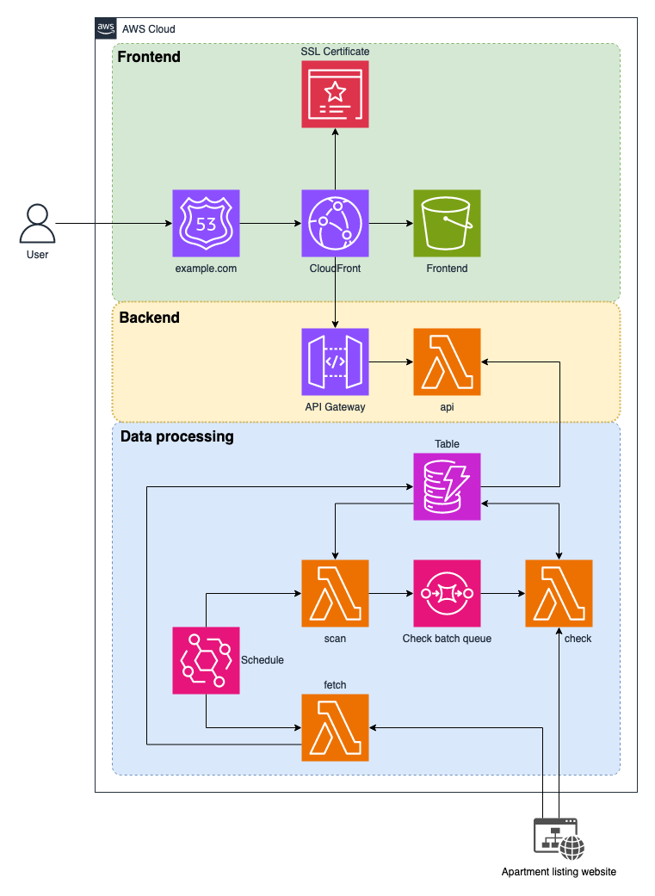
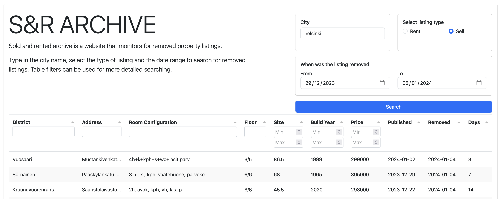

# S&R Archive

This repository contains application and IaC code. Terraform is used to deploy the code to AWS.

This application fetches new property listings from listing website and then monitors when listings get removed. Application contains API and website to view removed listings. 

I talked about this project on my [blog](https://vormisto.fi/posts/apartment-hunting/).

## How does it work

### Diagram

Only core functionality has been added to diagram to make it easier to read.



[Draw.io](https://app.diagrams.net/) was used to draw the diagram.

### Data processing

Data processing purpose is to retrieve property listings and save them to DynamoDB table. Data on table will be monitored for removal.

1. `fetch` lambda function will fetch new property listings and save them to DynamoDB. This function is invoked by EventBridge every X minutes.
2. `scan` lambda function will get the active listings from DynamoDB, divide them to batches and send the batches to SQS queue. This function is invoked once a day by EventBridge.
3. `check` lambda function will use the information in batches to check if listing is still active. If it is, do nothing. If it is not then modify the DynamoDB item to indicate that listing has been removed. Additionally add date when the listing was removed. Function is invoked by SQS.

### Backend

Backend purpose is to let user query removed property listings from DynamoDB table. 

1. Request to APIGW comes from CloudFront (or directly to api endpoint without caching)
2. APIGW forwards the request to `api` lambda function
3. `api` will query the removed listings from DynamoDB table, transform it to correct format and return it. `api` will also check when is the next `scan` function run date, add one hour to that and then use it as `Expires` header. Since data is changed only once a day we can cache it for maxium of 24h

### Frontend

Frontend purpose is to provide user-friendly way to interact with the backend API.

1. User will connect to CloudFront
2. CloudFront will check the path and based on that either forward the request to S3 for frontend website or to APIGW for backend API. Both S3 and APIGW responses are cached at CloudFront edge. 

Website is mix of HTML/CSS/JS. [Bootstrap](https://getbootstrap.com/) is used for styling, [Tabulator](https://tabulator.info/) for interactive table and vanilla javascript for fetching the data from backend API.

### Logging/Monitoring

All lambda functions use [logging](https://docs.python.org/3/library/logging.html) python library to log errors to CloudWatch logs. Lambda function `log_sqs` is invoked everytime `ERROR` is found in `check`, `api`, `fetch` or `scan` functions CloudWatch log. `log_sqs` will then send those errors to SQS queue. 

Lambda function `log_sns` is invoked by EventBridge every X min. This function will check the error SQS queue. If there are messages it will format the messages to a human readable format and use SNS to send email to address specified in the config. This is done to ensure the email address will not get bombarded in case application breaks. Only one email every X min.

Email alarm looks like this:

```
Function: <application_name>-<lambda_function>
LogGroup Name: /aws/lambda/<application_name>-<lambda_function>
LogStream: <year>/<month>/<day>/[$LATEST]<log stream hash>
Log Message(s):
[ERROR] <error message>
#########################################
Function: <application_name>-<lambda_function>
LogGroup Name: /aws/lambda/<application_name>-<lambda_function>
LogStream: <year>/<month>/<day>/[$LATEST]<log stream hash>
Log Message(s):
[ERROR] <error message number 2>
```

Logging/monitoring logic and code is heavily based on [this helpful blog post from AWS](https://aws.amazon.com/blogs/mt/get-notified-specific-lambda-function-error-patterns-using-cloudwatch/).

## Terraform

Custom modules are used for resources that are created more than once. Modules are stored in `terraform/modules/` directory.

On root `terraform/` directory files are named based on the AWS service. Each lambda function is separated to their own file, for those filename syntax is `lambda_<function name>.tf`. Lambda function code is stored in `lambda/<function name>/` directory.

`terraform/variables.tf` contains list and description of each variable that can be used. `terraform/terraform.tfvars_example` contains example variable values that could be used when deploying. Those values need to be modified.

## Screenshots

Frontend website used to interact with the data:

